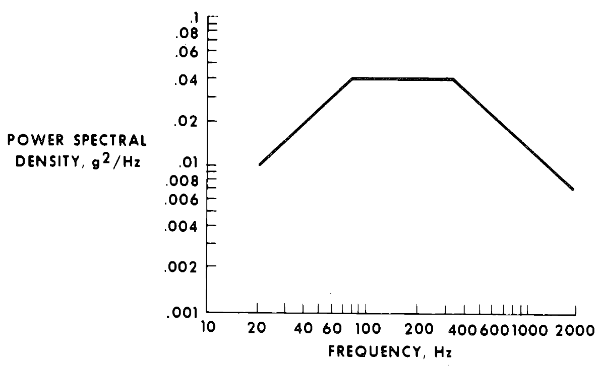
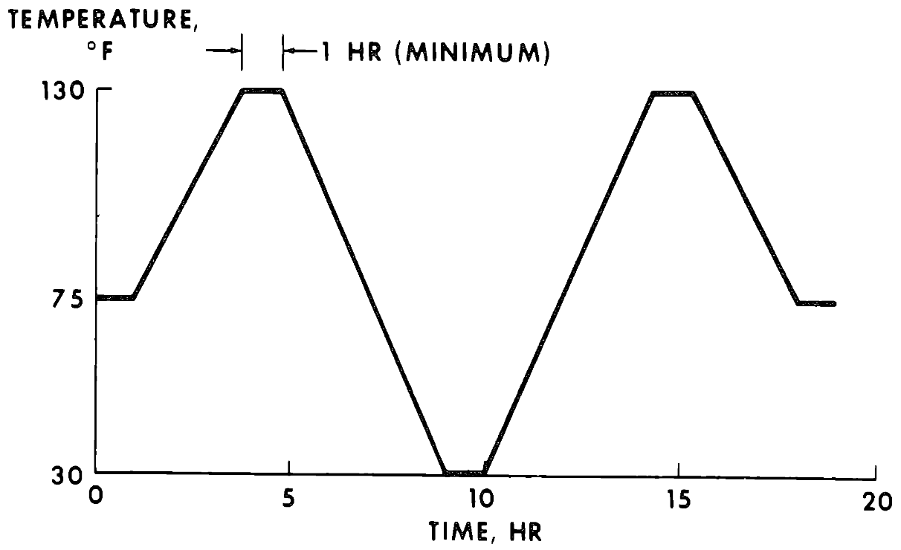
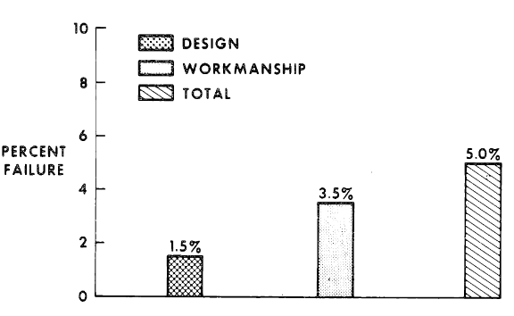
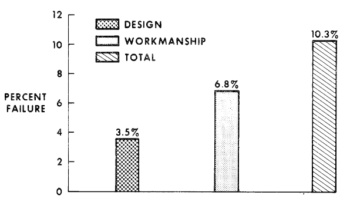
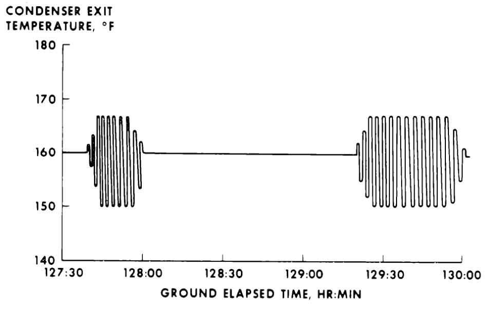
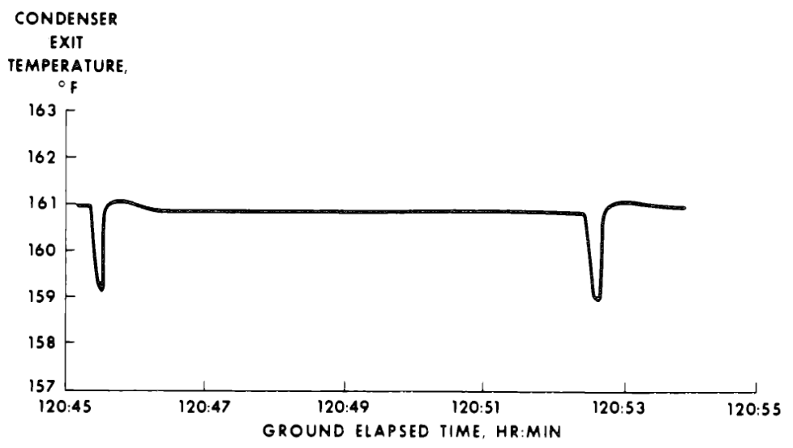
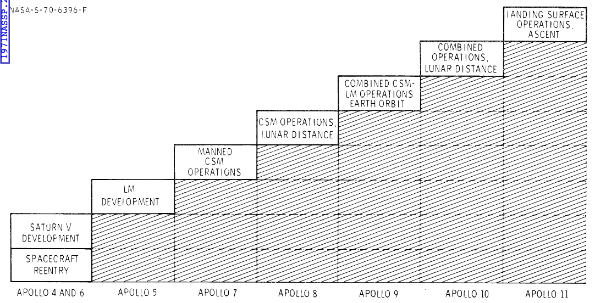

<!-- https://history.nasa.gov/SP-287/contents.htm -->

- [ВВЕДЕНИЕ](#введение)
  - [РАЗРАБОТКА КОСМИЧЕСКОГО КОРАБЛЯ](#разработка-космического-корабля)
    - [Проектирование Космического Корабля](#проектирование-космического-корабля)
    - [Тестирование Аполлона](#тестирование-аполлона)
    - [Контроль изменений](#контроль-изменений)
    - [Устранение неисправностей](#устранение-неисправностей)
  - [ПОЛЕТНЫЕ МИССИИ](#полетные-миссии)
    - [Постановка Миссии](#постановка-миссии)
    - [Планирование и выполнение миссии](#планирование-и-выполнение-миссии)
  - [ПОДГОТОВКА ЭКИПАЖА](#подготовка-экипажа)
  - [ЗАКЛЮЧИТЕЛЬНЫЕ ЗАМЕЧАНИЯ](#заключительные-замечания)

# ВВЕДЕНИЕ
**Автор: Джордж М. Лоу**

**Центр пилотируемых космических кораблей**

20 июля 1969 года человек впервые ступил на другую планету. Этот "гигантский скачок для человечества" представлял собой одно из величайших инженерных достижений всех времен. В этой статье, а также в других статьях этого документа, описываются и обсуждаются некоторые из разнообразных задач, стоящих за этим достижением.

Мы ограничимся теми задачами, которые были прямой ответственностью Центра пилотируемых космических кораблей NASA: разработка космических кораблей, проектирование миссий и планирование миссий, операции с экипажем полетов и операции полетов. Мы опишем принципы проектирования космических кораблей, чрезвычайно важные испытания космических кораблей, а также дисциплину, которая эволюционировала в контроль изменений космических кораблей и устранение аномалий космических кораблей; и мы обсудим, как мы определили лучшую серию полетов, ведущих к лунной посадке в кратчайшие сроки, как эти полеты были запланированы в деталях, техники, использованные при установлении процедур полетов и проведении операций полетов, и, наконец, подготовку экипажа и деятельность по симуляции — деятельность, которая привела к идеальному выполнению полета астронавтами.

Короче говоря, мы опишем три основных ингредиента успеха Аполлона: космическое оборудование, которое является наиболее надежным, полетные миссии, которые спланированы и выполнены чрезвычайно хорошо, и летные экипажи, которые превосходно обучены и квалифицированы. (Мы не будем обсуждать два не менее важных аспекта Аполлона — ракеты-носители и операции запуска. Эти элементы - ответственность Центра космических полетов Маршалла NASA и Космического центра Кеннеди NASA, и выходят за рамки этой серии статей.)

## РАЗРАБОТКА КОСМИЧЕСКОГО КОРАБЛЯ
Можно выделить четыре основных аспекта разработки космического корабля: проектирование, тестирование, контроль изменений и локализация/интерпретация расхождений. Мы можем начать с них.

### Проектирование Космического Корабля
Принципы проектирования пилотируемого космического корабля включают в себя сочетание практик проектирования самолетов и технологии проектирования ракет: построй аппарат простым, а затем удвой многие компоненты и системы, так что если одна из них выйдет из строя, другая возьмет на себя ее функции. Примерами такого подхода могут служить абляционные камеры сгорания, которые не требуют регенеративного охлаждения; гиперголическое топливо, которое не требует источника зажигания; три топливных элемента (fuel-cell - кислородно-водородный источник электроэнергии и воды - прим. пер.), где один в одиночку мог бы вернуть космический корабль с Луны; последовательная/параллельная избыточность в клапанах, регуляторах, конденсаторах и диодах, так что ни отказ "открытия", ни отказ "закрытия" не будут катастрофой.

Другое важное правило проектирования, о которое мы не обсуждали так часто, как следовало бы, гласит: минимизируйте функциональные интерфейсы между сложными частями оборудования. Это позволяет двум организациям работать над своим оборудованием относительно независимо. Примером в программе Аполлон может служить интерфейсы между космическим кораблем и ракетой-носителем, а также между командным модулем и лунным модулем. Всего около 100 проводов соединяют ракету-носитель Сатурн и космический корабль Аполлон, причем большинство из них связаны с системой обнаружения аварий. Есть две причины, по которой это число не могло быть еще меньше: во первых используются избыточные цепи, а во вторых электричество всегда поступает из модуля или ступени, где должна быть выполнено действие. Например, замыкание реле в ракете-носителе могло бы в автоматическом режиме аварийного прекращения полета активировать двигатель аварийного спасения космического корабля. Но электрическая энергия для этого, согласно проекту, поступает из батарей космического корабля. Основная идея заключается в том, что один человек может полностью понять этот интерфейс и может справиться со всеми последствиями изменения с любой стороны интерфейса. Если бы проводов было в 10 раз больше, вероятно, потребовалось бы в сто (или тысячу?) раз больше людей для работы с таким интерфейсом.

Другой вопрос проектирования пилотируемого полета касается роли самого человека. Здесь снова нет простого правила, как человек должен взаимодействовать с машиной. Обычно, утомительные, повторяющиеся задачи лучше всего выполнять автоматически; а вот выбор наилучшего источника данных, выбор режимов управления и переключение между дублирующими друг друга для надёжности системами — задачи, которые лучше всего выполняет пилот. В Аполлоне тенденция заключалась в том, чтобы полагаться все больше и больше на автоматические режимы по мере накопления опыта работы систем. Например, компьютерные программы для стыковки были переработаны так, чтобы требовать гораздо меньше ввода оператора, чем изначально планировалось, но при этом весь процесс стыковки был спроектирован так, чтобы пилот всегда мог контролировать работу автоматической системы и применять резервное решение в случае обнаружения отклонений. Огромное количество времени и усилий было потрачено на формулирование того, как именно экипаж может выбрать, какой источник данных использовать и на какие из многих избыточных систем полагаться. Это всегда было основным соображением при проектировании миссии.

Концепция техобслуживания в полете была полностью отвергнута как непрактичная для полетов с такой целью и такой продолжительностью полёта, как были у Аполлона. Вместо этого было добавлено много телеметрии, используя которую наземные службы мониторили работу систем, предсказывали тенденции и сравнивали полётные данные с данным предполётного тестирования.

Вместо этого было добавлено больше телеметрии и использовалась возможность наземных служб оценить работу систем, предсказать тенденции и сравнить данные полёта с данными предполетного тестирования.

### Тестирование Аполлона
Наиболее важным фактором, приведшим к такой высокой степени надежности Аполлона, была глубочайшая и широчайшая программа тестирования.

Существует две главные категории тестов: (1) те, которые проводятся на прототипе устройства (или на нескольких прототипах) для демонстрации корректности проекта и его работоспособности в любых условиях/средах, и (2) те, которые проводятся над каждым компонентом непосредственно перед полётом, чтобы убедиться в отсутствии брака производства и в том, что предмет будет функционировать согласно проекту во время выполнения миссии. Обе категории применяются к отдельным частям, компонентам, подсистемам, системам и целым космическим кораблям. Первая категория включает в себя разработку тестов на раннем этапе проектирования и очень формальные сертификационные или квалификационные тесты, проводимые на тестовых изделиях, идентичных их полётному аналогу. Вторая категория охватывает приемочные испытания.

Вместо того, чтобы рассматривать программы разработки и квалификационных испытаний целиком, мы можем сосредоточиться только на тех испытаниях, которые включают в себя космические корабли или макеты целиком, как указано в таблице 1-I. Каждый из этих тестов научил нас многому о наших космических кораблях — их сильных и слабых сторонах. В результате термовакуумных [воспроизводящих одновременно условия по температуре и давлению - прим. пер.] испытаний космический корабль выдержал транслунные и лунные условия без единой термической проблемы. Были разработаны пассивные режимы термоконтроля, которые требовали минимального участия экипажа и обеспечивали идеальный термобаланс. Испытания на удар при посадке показали, что командный модуль может выжить при аварийной посадке на сушу, если скорость ветра остается в определенных пределах. Эти испытания также привели к разработке новой амортизационной стойки для кресла астронавта. Эта стойка позволила нам увеличить допустимую скорость ветра при запуске и тем самым дала больше гибкости в условиях достаточно ограниченного окна запуска. Другие тесты принесли не менее значимые результаты.

| Таблица 1-I. - Промежуточные и приёмочные испытания | |
|---|---:|
| [Испытания полномасштабных моделей космических кораблей] | |
| Полётные испытания двигателя системы спасения | 7 |
| Испытания парашютной системы | 40 |
| Испытания удара при посадке командного модуля на сушу | 48 |
| Испытания удара командного модуля о воду | 52 |
| Структурные испытания падения лунного модуля | 16 |
| Полные испытания падения лунного модуля | 5 |
| Акустические/вибрационные испытания командного и служебного модуля, в часах | 15.5 |
| Акустические/вибрационные испытания лунного модуля, в часах | 3.5 |
| Модальные (разновидность вибрационных - прим. пер.) испытания командного и сервисного модуля, в часах | 277.6 |
| Модальные испытания лунного модуля, в часах | 351.4 |
| Термовакуумные испытания командного и служебного модуля, в часах | 773 |
| Термовакуумные испытания лунного модуля, в часах | 2652 |
| Испытания двигательной установки служебного модуля, в минутах | 1474.5 |
| Испытания двигательной установки ступени восхождения, в минутах | 153 |
| Испытания двигательной установки ступени спуска, в минутах | 220 |

Самое важное — тесты дали нам огромный опыт работы с космическим кораблем и его системами. Такой опыт, наряду с детальным анализом всех предыдущих сбоев, несоответствий и аномалий, привел нас к выводу, что мы были готовы к полету на лунную орбиту с "Аполлоном 8" и что мы были готовы к осуществлению лунной посадки с "Аполлоном 11".

Приемочное тестирование играло равно важную роль. Это тестирование начинается с отдельных деталей. Хотя "Аполлон" внедрил это правило с опозданием, я убежден, что отбраковка и burn-in тестирование (тестирование при повышенной температуре и, зачастую, вольтаже - прим. пер.) электронных компонентов должна быть обязательной процедурой. Затем каждый компонент или "черный ящик" тестируется перед отправкой с места производства и затем еще раз перед установкой в космический корабль. После этого начинается заводское тестирование полного космического корабля. Сначала проверяется проводка, и отдельные подсистемы тестируются по мере установки. Затем группы систем тестируются совместно. Наконец, полный космический корабль с функционирующими системами подвергается интегрированному тестированию. Проверяются все нормальные, аварийные и резервные режимы.

После доставки на стартовый комплекс снова проводятся аналогичные (по возможности идентичные) тесты. Основным тестом на мысе Канаверал является испытание в маневренной камере с экипажем для каждого космического корабля. Конечно же, окончательным приемочным тестом является сам обратный отсчет.

Очень важным аспектом приемочного тестирования являются приёмочные испытания на воздействие условий окружающей среды. Основная цель приёмочного вибрационного тестирования  и приёмочного термического тестирования — обнаружение ошибок производства. Для этого условия должны быть достаточно суровыми, чтобы обнаружить неисправность (например, плохо припаянное соединение), но не настолько суровыми, чтобы ослабить или расшатать компонент. Рисунки 1-1 и 1-2 показывают уровни, выбранные для этих тестов в "Аполлоне". Эти уровни были выбраны на основе опыта программы "Джемини" и других программ. Каждый тип компонента, конечно, должен был пройти квалификационные тесты в еще более суровых условиях. Тем не менее, наши тесты приемки в условиях окружающей среды иногда выявляли конструктивные недостатки (в отличие от ошибок изготовления), которые были упущены во время квалификационных тестов. Причина заключалась в том, что один квалификационный тест мог пропустить граничное условие, которое большое количество приемочных тестов могло выявить.

**Рисунок 1-1.** Уровни вибрационных приёмочных испытаний

**Рисунок 1-2.** Уровни термических приёмочных испытаний

Мы также рассматривали приёмочные испытания на воздействие условий окружающей среды для космических кораблей целиком, но отказались от этой идеи, поскольку условия воздействия на большинство компонентов, установленных в космическом корабле, в таких тестах будет недостаточно суровым, чтобы выявить дефекты изготовления. Уровни вибрации на многих компонентах получались на один или два порядка ниже, чем те, что представлены на рисунке 1-1. (Этот вывод не был бы верен для более маленьких и компактных космических кораблей.)
Температуры же в космическом корабле обычно остаются постоянными, потому что большинство электронных компонентов установлены на холодных пластинах.

Рисунки 1-3 и 1-4 обобщают результаты приёмочных испытаний на воздействие условий окружающей среды для Аполлона. Обратите внимание, что 5 процентов всех компонентов не выдержали вибрационных испытаний (!!!), и 1.3 процента всех компонентов не прошли термические испытания. Помните, что эти компоненты в противном случае были бы установлены в космический корабль. По категориям типы отказов разбиты так, как перечислено в таблице 1-II. Если бы эти испытания не были проведены и если бы эти отказы произошли во время полета, мы, скорее всего, все еще ждали бы первой пилотируемой лунной посадки.

**Рисунок 1-3.** Результаты 11447 вибрационных приёмочных тестов для 166 различных компонентов.

**Рисунок 1-4.** Результаты 3685 термических тестов для 127 различных компонентов.

ТАБЛИЦА 1-II. - ИСТОРИЯ ОТКАЗОВ ПРИ ПРИЁМОЧНЫХ ИСПЫТАНИЯХ НА ВОЗДЕЙСТВИЕ УСЛОВИЙ ОКРУЖАЮЩЕЙ СРЕДЫ

| Режим         | Процент отказов |
|---------------|-----------------|
| Электрический | 57.3            |
| Механический  | 27.4            |
| Загрязнение   | 11.5            |
| Прочее        | 3.8             |
| Итого         | 100             |

### Контроль изменений

Если дизайн проекта был верифицирован, а программа тестирования пройдена, то, возможно, вам и не потребуется вносить никаких изменений. Но, естественно, такая идеальная ситуация невозможна в программе, подобной "Аполлону", где дизайн, тестирование и непосредственно полеты часто пересекаются и должны выполняться одновременно. Изменения могут потребоваться из-за неудачных тестов или в результате повторного анализа проекта, который может выявить ситуацию, приводящей к отказу системы или невозможности на него корректно отреагировать. Иногда более подробное определение миссий полета или использования аппаратуры само по себе может потребовать изменений.

Поскольку невозможно избавится от всех будущих изменений, необходимо исходить из предпосылки, что любое изменение будет нежелательным. То есть, изменение аннулирует все предыдущие испытания и накопленный опыт полетов и, каким бы простым оно ни было, может иметь последствия, гораздо более широкие, чем те, которые были определены первоначальным инженерным анализом.
А поскольку изменения всё равно необходимо будет вносить, становится крайне важным понимать и контролировать их, независимо от их размера. В программе "Аполлон" мы управляли всеми изменениями через серию Конфигурационных Контрольных Собраний (Configuration Control Panels) и Конфигурационный Контрольный Совет (Configuration Control Board). Собрания рассматривали незначительные изменения аппаратного обеспечения на ранних этапах разработки, а также процедуры проводимые экипажем и всё программное обеспечение. Совет же рассматривал более значительные изменения аппаратного обеспечения, все изменения аппаратного обеспечения после сборки и доставки космического корабля, а также изменения процедур или программного обеспечения, которые могли повлиять на графики или миссии.
Конфигурационный Контрольный Совет космического корабля "Аполлон" собирался 90 раз между июнем 1967 года и июлем 1969 года, рассмотрел 1697 изменений, одобрил 1341 и отклонил 356. У нас был низкий процент отказов, потому что предлагаемые изменения были рассмотрены до того, как они были представлены Совету, и только те, которые считались обязательными для безопасности полета, были представлены на его рассмотрение.
Совет возглавлял менеджер программы, который также принимает окончательное решение по всем изменениям. В Совет входят директора всех основных технических элементов Центра пилотируемых космических полетов НАСА и менеджеры программ подрядчиков.
Мы рассматривали как большие так и малые изменения. Примером крупного изменения является новый люк космического корабля, который был внедрен после пожара (пожар на испытаниях Аполлон-1, в результате которого погиб весь экипаж - В. Грисс, Э. Уайт и Р. Чаффи. - прим. пер.). При этом мы рассматривали с таким-же вниманием и относительно небольшие изменения, к примеру такие как маленький кусочек пластика для внутренней части шариковой ручки астронавта.
Совет был создан для усиления контроля за изменениями; однако было замечено, что он служит и для гораздо более широкой цели: он составлял форум для принятия совместных решений разработчиками и "пользователями" космического корабля. Принимая наши решения, мы опирались на совокупные мнения ключевых людей, представляющих разработку аппаратного обеспечения, операции полета, экипажи полетов, безопасность, медицину и науку.
Я недавно пересмотрел результаты 90 заседаний Совета, которые предшествовали "Аполлону 11". Даже в ретроспективе я нахожу лишь немногие, если вообще нахожу, решения Совета, которые я сейчас читаю неверными.

### Устранение неисправностей
На протяжении всей программы "Аполлон" ежедневно происходило множество расхождений и сбоев. Неисправность могла быть непосредственной (то есть сбои фактически происходили во время тестирования следующего летательного аппарата) или косвенной (то есть компонент, идентичный использованному в "Аполлоне", выходил из строя в другой программе). В любом случае результат был одинаковым: необходимо было понять причину сбоя и, при необходимости, предпринять корректирующие действия. Такие действия могли включать изменение конструкции, повторную инспекцию или, возможно, изменение алгоритмов и процедур миссии.
Я ограничу свои замечания аномалиями, которые произошли во время первых пяти пилотируемых полетов "Аполлон". Количество аномалий каждой миссии приведено в таблице 1-III.
Стоит отметить, что, хотя каждый из полетов был полностью успешным и достиг всех своих целей, количество аномалий было довольно высоким. Возможно, это лучшее подтверждение правильности концепции проектирования "Аполлона": космические корабли были спроектированы для успешного выполнения миссии.

ТАБЛИЦА 1-III. - Количество аномалий  в полётах "Аполлон"

| Космический аппарат | Командный и служебный модули | Лунный модуль |
|----------------------|----------------------------|---------------|
| Аполлон 7            | 22                         | --            |
| Аполлон 8            | 8                          | --            |
| Аполлон 9            | 14                         | 12            |
| Аполлон 10           | 23                         | 15            |
| Аполлон 11           | 9                          | 13            |

Устранение этих сбоев в полете должно было быть выполнено в промежутки времени между завершением одного полета и началом следующего — период, который обычно составлял всего около 6 недель. Тем не менее, даже эти 6 недель не были полностью свободны, поскольку компоненты гиперголические топлива (компоненты которой самопроизвольно воспламеняются при соприкосновении друг с другом - прим. пер.) заливались в космический аппарат за месяц до запуска, что серьезно ограничивало возможность внесения изменений в космический аппарат и проведения необходимого повторного тестирования. Тем не менее, каждый из сбоев, перечисленных в таблице 1-III, был успешно устранен до следующего полета.

Давайте рассмотрим следующий пример. Во время полета "Аполлон 10", во время нескольких лунных орбит, критическая температура топливного элемента начала значительно колебаться, как показано на рисунке 1-5. Обычно эта температура стабильна и находится в диапазоне от 155° до 165° F. Колебания, возникшие на "Аполлоне 10", активировали систему сигнализации космического аппарата, но не вызвали каких-либо других негативных последствий. Тем не менее, не понимая их причины, мы не могли быть уверены, что они навсегда останутся в пределах того, как это было в "Аполлоне 10", и, следовательно, что они не приведут к отказу топливного элемента.

Наше исследование показало, что малые, изолированные нарушения температуры топливного элемента часто встречались, как показано на рисунке 1-6. Pratt & Whitney, North American и НАСА затем провели подробный анализ стабильности системы топливного элемента, функции передачи были экспериментально определены, и, наконец, был проведен полный тест топливного элемента для подтверждения результатов анализа. Эта работа показала, что малые, изолированные нарушения могут вызвать нестабильность, если нагрузка на электроснабжение достаточно высока и температура достаточно низка. Анализ также показал, что амплитуда колебаний всегда будет ограничена, как это было в "Аполлоне 10". Имея эту информацию, стало возможным разработать процедуры для устранения колебаний, если они возникнут.

Описанное здесь решение, возможно, звучит просто. Тем не менее, подобная задача, сформулированная как исследовательское задание, могла бы занять год или даже больше времени для выполнения. Здесь устранение сбоя было выполнено за недели.

Аномалия с топливным элементом была только одним примером расхождения. Общая задача — устранение всех полетных аномалий — была огромной; тем не менее, она была завершена к моменту каждого полёта.

**Рис. 1-5.**- Реальные полётные температурные осцилляции топливных элементов Аполлона 10

**Рис. 1-6.**- Полученные в лаборатории нарушения температуры топливных элементов Аполлона 10

## ПОЛЕТНЫЕ МИССИИ

Очень сложно описать тем, кто не был непосредственно связан с программой "Аполлон", как много работы было вложено в планирование операций. Во-первых, мы должны были решить, какие типы миссий будут выполнены: какая серия миссий лучше всего поможет достичь успешной пилотируемой посадки на Луну в кратчайшие сроки? Затем эти миссии должны были быть запланированы в деталях: какой должна быть каждая миссия, чтобы достичь максимального количества оперативных и технических целей, даже в случае непредвиденных событий? (Оперативные цели касаются навигации, управления траекторией, стыковки и т.д.; технические цели связаны с проверкой каждой системы или подсистемы в условиях полета.) Наконец, необходимо было составить планы выполнения миссии: были разработаны подробные правила для всех мыслимых непредвиденных обстоятельств; были определены надлежащие дисплеи управления полетом, позволяющие мгновенно реагировать на чрезвычайные ситуации, и бесчисленные часы были потрачены на моделирование каждой мыслимой ситуации.

### Постановка Миссии

В начале 1967 года складывалась следующая ситуация. Было проведено множество опытно-конструкторских полетов для тестирования системы запуска-покидания в экстремальных условиях, для тестирования системы тепловой защиты командного модуля на скоростях, находящихся на полпути между орбитальной околоземной и лунной скоростями возвращения в атмосферу, и для предварительного тестирования систем наведения и двигательной установки. Однако "Сатурн V" еще не был испытан в полёте, вход в атмосферу со скоростью возвращения на Луну еще не был осуществлен, лунный модуль еще не был облетан, и человек еще не побывал в космосе на аппаратном обеспечении "Аполлона".

Программа летных испытаний, показанная на рис. 1-7, была доработана с помощью итеративного и гибкого процесса, меняющегося со временем, чтобы наиболее эффективным образом использовать знания об операциях миссии и доступности оборудования в любой момент времени. Основной принцип планирования этих полетов состоял в том, чтобы получить максимум нового опыта (нужном для достижения цели высадки на Луну) от каждого полете, при этом не перегружая ни оборудование, ни людей сверх их возможностей для выполнения следующего шага.

**Рис. 1-7.**- Наращивание возможностей миссий "Аполлон".

Слишком маленький шаг лишь добавлял риска, который присущ любому пилотируемому полёту, без достижения существенного выигрыша - без реального продвижения к высадке на Луну. Слишком большой шаг, с другой стороны, мог превысить текущие возможности системы до точки, когда риски стали бы чрезмерными, так как новые требования на операциям в полёте превысили бы то, что люди успевали изучить и отработать в доступное им время.

"Аполлон-4" и "Аполлон-6" увидели первые полеты Сатурна V. "Аполлон-4" был почти буквальным совершенством. Тем не менее, был запланирован повторный полет, который, как сейчас понятно, оказался очень важным. Серьезные дефекты в двигательной установке "Сатурна" и в адаптере космического корабля, которые не были заметны на "Аполлоне-4", вызвали серьезные сбои на "Аполлоне-6". Эти сбои привели к проведению обширной программы наземных испытаний и внесению изменений в аппаратное обеспечение перед следующим полетом ракеты-носителя. "Аполлон-4" также послужил для проверки теплозащитного экрана космического корабля в суровых имитируемых условиях возвращения на Луну; полёт показал, что конструкция была консервативной.

"Аполлон-5" стал беспилотным полетом лунного модуля. Система наведения лунного модуля, обе двигательные установки и важнейшая последовательность этапов между подъемом и спуском функционировали хорошо.

Первый пилотируемый полет командного-служебного модуля состоялся в октябре 1968 года на "Аполлоне-7". Аппарат превзошел все ожидания в этом 11-дневном полете. Каждая из систем командно-служебного модуля (за исключением системы стыковки) отработала без существенных сбоев.

Решение о выходе на лунную орбиту на "Аполлоне-8" было принято относительно поздно. Оно было предварительно принято в августе 1968 года. На тот момент опыт тестирования командно-служебного модуля был очень положительным. График разработки лунного модуля, при этом, нарушался; и первый пилотируемый лунный модуль столкнулся с обычными трудностями "первого корабля" при проверке в Космическом центре Кеннеди НАСА. Кроме того, подробный анализ результатов работы беспилотного лунного орбитального аппарата показал, что навигация вокруг Луны сопряжена со многими неожиданными вычислительными трудностями.

По всем этим причинам было решено, что полет "Аполлона-8" на лунной орбите будет включать в себя только работу CSM (командного-служебного модуля, то есть без лунного модуля - прим. пер.). Это решение было подтверждено успехом "Аполлона-7", и игральные кости указали [WTF??] на совершение первого полета человека на Луну в декабре 1968 года.

В "Аполлоне-9" же оба космических корабля, лунный модуль и командно-служебный модуль, впервые были испытаны вместе. Сначала все системы лунного модуля были протестированы в пилотируемом полете. Затем были разработаны и проверены методы для следующих операций с космическими аппаратами: связь между двумя космическими аппаратами и землей; отслеживание, наведение и навигация; а также сближение и стыковка. Также на "Аполлоне-9" был испытан модуль внекорабельного передвижения (лунный скафандр и его система жизнеобеспечения) в реальных космических условиях.

После " Аполлона - 9 " было необходимо принять еще одно решение: были ли мы готовы к высадке на Луну или шаг был слишком большим? Мы решили, что столкнулись со слишком многими оставшимися неизвестными переменными: характеристики лунного модуля в условиях дальнего космоса, связь с лунным модулем на лунных расстояниях, совместные операции с двумя космическими аппаратами вокруг Луны, сближение вокруг Луны и, конечно, посадка при спуске на Луну, операции на поверхности и подъем. Вместо приземления мы планировали выполнить как можно больше из этих задач на "Аполлоне-10", однако без фактического прилунения.

Вся серия полетов представляла собой поэтапное наращивание полётных заданий, каждый шаг приближал к будущему прилунению. Согласно нашей стратегии, мы использовали процедуры, разработанные для одного полета, в каждой последующей миссии. Изменения допускались только в том случае, если они были необходимы для обеспечения безопасности полёта или для достижения успеха всей миссии. С помощью этого постепенного наращивания мы свели к минимуму оставшиеся задачи (спуск, посадка, работа на поверхности Луны и взлёт), которые могли быть отработаны только в ходе самого прилунения. Благодаря этому экипаж "Аполлона-11" смог сконцентрироваться на этих оставшихся задачах, детально проработать их и выполнить в совершенстве.

### Планирование и выполнение миссии

После определения основных задач, необходимо было детально спланировать каждый полет. Ответственны за планирование миссий старается предусмотреть в каждом полете максимальное количество тестов оборудования и как можно больше разнообразных операций. Например, он разработает профиль сближения для одиночного полета по околоземной орбите, который включает все нормальные и ненормальные условия сближения, которые могут возникнуть вокруг Луны - сближение сверху, сближение снизу, сближение с активным лунным модулем, сближение с активным командно-служебным модулем и сближение при различных условиях освещения. В то же время планировщик миссии попытается задействовать все двигательные установки и все навигационные системы на обоих космических аппаратах.

После планов миссии следуют методы выполнения миссии (другое название - приоритет данных). Учитывая два или три источника данных (для построения траектории), какому из источников следует верить, а от какого отказаться? Необходимо было определить ограничения для каждой системы и разработать логические схемы для каждой мыслимой ситуации.

Наконец, за дело берутся операторы полётов. Они, конечно, участвовали в планировании полета и в работе с техникой выполнения полета; но теперь им приходилось отрабатывать каждый этап полета и предсказывать каждую возможную аварийную ситуацию, которая может возникнуть. Как правильно действовать, если из строя выйдет один топливный элемент? А что делать, если из строя выйдут оба? Ответы на тысячи подобных вопросов должны были быть получены для каждого этапа миссии в отдельности. Отказ радара сближения перед расстыковкой командно-служебного и лунных модулей означает, что два корабля не должны расстыковываться. При этом такой же сбой после расстыковки позволяет продолжить миссию, поскольку риск сближения без радара уже возник и не увеличится в процессе совершения миссий. Каждое из этих событий было задокументировано в виде правил полета задолго до его начала, и эти правила были помещены под "управление конфигурацией" [wtf TODO], как и любой другой аспект системы Apollo.

Операторы полета также разработали оптимальные пользовательские интерфейсы для дисплеев режима реального времени. Во время спуска "Аполлона-11" на поверхность Луны операторы полета могли наблюдать с задержкой всего в 6-10 секунд за функционированием почти каждой бортовой системы. Они увидели повышение давления в камере, когда спускаемый двигатель был разогнан до полной тяги, и могли видеть, что сброс газа произошел в нужный момент. Операторы полета также могли сравнить траекторию снижения из трех источников данных - двух бортовых систем наведения и наземной системы наблюдения. Располагая этой информацией, оператор на земле мог приказать экипажу, находящемуся на расстоянии почти 250 000 миль, игнорировать сигналы тревоги от бортового компьютера во время наиболее критической части снижения, поскольку система на самом деле правильно направляла космический корабль.

Многие методы, используемые во время полета, были разработаны в ходе бесчисленных часов симуляций. Симуляция - это игра в "что, если". Что, если компьютер откажет? Что, если двигатель не сможет стартовать? Что, если ... ? В игру играют снова и снова. Диспетчеры полетов не знают, с какой ситуацией они столкнутся в следующей симуляции. К началу полёта они проведут уже так много симуляций и так сработаются вместе как команда, что смогут справиться с любой нештатной ситуацией.

Поскольку оборудование "Аполлона" отработало очень хорошо и поскольку случилось так мало нештатных ситуаций, сейчас можно было бы сделать вывод, что большая часть планирования, многие методы выполнения миссии и большая часть обучения были проведены впустую. Но это неверный вывод. Как минимум, состояние готовности, возникшее в результате этих усилий, придало нам смелости и уверенности для перехода от одной миссии к следующей. Кроме того, были ситуации - предупреждения бортового компьютера во время спуска "Аполлона-11" и разряд молнии во время запуска "Аполлона-12", - которые могли привести к прерыванию полета, если бы команда была хуже подготовлена и не так готова к неожиданностями.

## ПОДГОТОВКА ЭКИПАЖА

В первых шести пилотируемых полетах "Аполлона" участвовало 18 астронавтов - все профессиональные пилоты, квалифицированные и великолепно подготовленные. В общей сложности они совершили 18 полетов на "Меркурии" и "Джемини", прежде чем полетели на космическом корабле "Аполлон". Пятеро летали до этого дважды, восемь - один раз, а еще пятеро впервые полетели именно на "Аполлоне".

Подготовка к "Аполлону" тяжела. Задействованы две сложнейшие машины, каждая из которых намного сложнее, чем "Джемини". Астронавтам пришлось стать экспертами в управлении обоими космическими аппаратами. Они стали программистами и пользователями бортовых компьютеров, космическими навигаторами, экспертами по сближению и стыковке, инженерами двигателей, операторами топливных элементов, экспертами по системам контроля - и это лишь некоторые области знаний. При этом им пришлось научиться управлять двумя космическими аппаратами с совершенно разными характеристиками в условиях запуска, окололунного полета, полета по окололунной орбите, посадки на Луну, взлёта с Луны, сближения, стыковки, трансземного полета и возвращения в атмосферу.

Астронавты использовали различные тренировочные устройства - самолёты с высокими лётными характеристиками, чтобы оставаться подготовленными и внимательными; специальный динамический симулятор запуска, чтобы отрабатывать ручные режимы взлета и прерывания полета; симуляторы полета, чтобы дублировать здесь, на Земле, все функции и мониторинг космического корабля во всех возможных условиях; имитацию частичной гравитации под водой, в самолетах и на специальном устройстве с сервоуправлением на земле; тренажер сближения и стыковки; и летающий учебный аппарат для посадки на Луну, оснащенный реактивным двигателем, который выдерживает силу тяжести в пять шестых земной, чтобы аппарат имел те же летные характеристики, что и лунный модуль на Луне.

Астронавтам также требовались планы и прописанные процедуры. В планах полета был прописан каждый этап миссии. Были разработаны подробные "временные рамки" для каждой операции, которую нужно было выполнять, минута за минутой. Процедуры для экипажа и чеклисты дополняли программу полета. Пошаговая последовательность действий каждого космического аппарата, каждого маневра, каждого запуска двигателя была отработана заблаговременно и использовалась снова и снова в ходе практики и моделирования.

Управление конфигурацией миссии (Configuration control) было так же важно при подготовке астронавтов, как и в любой другой предполётной деятельности. Тренажеры должны были выглядеть точно так же, как настоящий космический корабль, чтобы быть полезными, и изменения, внесённые в последнюю минуту в конструкцию космического корабля также должны были быть включены и в тренажеры. Процедуры экипажа, которые хорошо сработали в одном полёте, не могли быть изменены по "пожеланиям экипажа" для следующего полёта.

Пит Конрад сказал, что посадка лунного модуля его "Аполлона-12" после того, как пыль (поднявшаяся из непредвиденно толстого слоя лунной под струей посадочных двигателей - прим.пер.) скрыла место посадки, оказалась самой сложной задачей, которую он когда-либо выполнял. Ему потребовался весь 20-летний опыт профессионального пилота, его предыдущая работа на двух миссиях Gemini, его подготовка к "Аполлону", а также его знания и уверенность в системах космического корабля "Аполлон", для успешного прилунения.

## ЗАКЛЮЧИТЕЛЬНЫЕ ЗАМЕЧАНИЯ

Разработка космического корабля, полетные операции и подготовка летного состава - пересматривая эти аспекты программы "Аполлон", я вижу одно главное соображение, которое выделяется среди всех остальных: внимание к деталям. Кропотливое внимание к деталям в сочетании со стремлением всех людей на всех уровнях добросовестно выполнить работу над каждым элементом "Аполлона" привели к успеху того, что должно стать одним из величайших инженерных достижений всех времен - первой высадки человека на Луну. Последующие главы лишь подтверждают это наблюдение.

